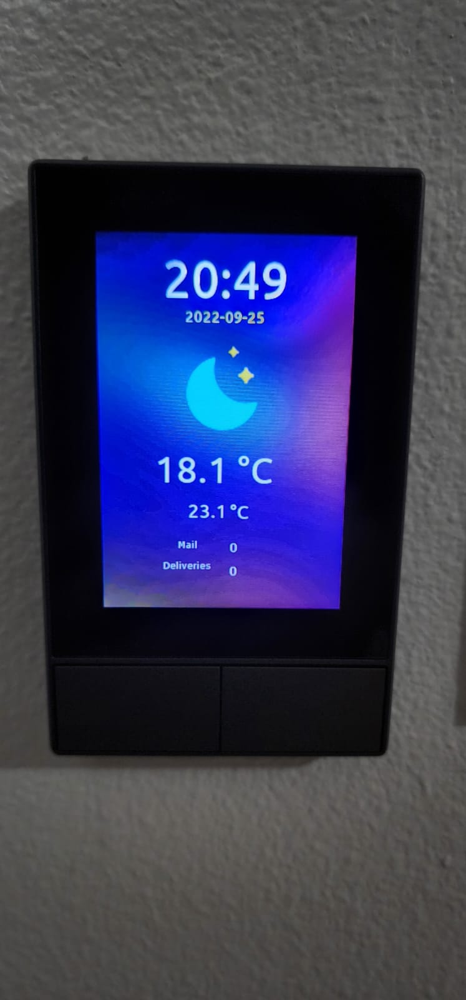

# nspanel_US_NMC
This Repo is for the **US version** of the nspanel from Sonoff.

The view is **vertical** instead of horizonal like the EU version.

This Repo is based on [marcfager panel](https://github.com/marcfager/nspanel-mf).

The **tutorial** that I followed to get my NSPanel flashed can be found [HERE](https://www.youtube.com/watch?v=p-AK4o5jOSI).

This version includes a new "ceiling fan" icon with on/off option inside the HMI/tft.

This version includes a new look and feel for the Notifications section.

This version includes some different incons from the ones on the original repo.

You will find the parts you need to replace by only searching "#Change ME" inside the yaml file.

## HMI Screenshots

